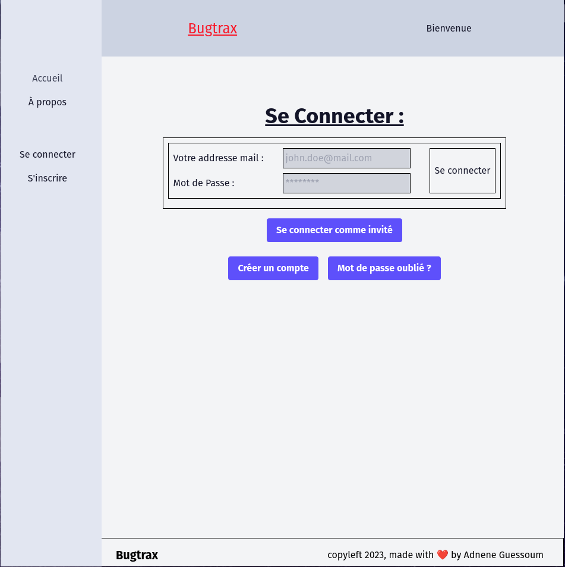
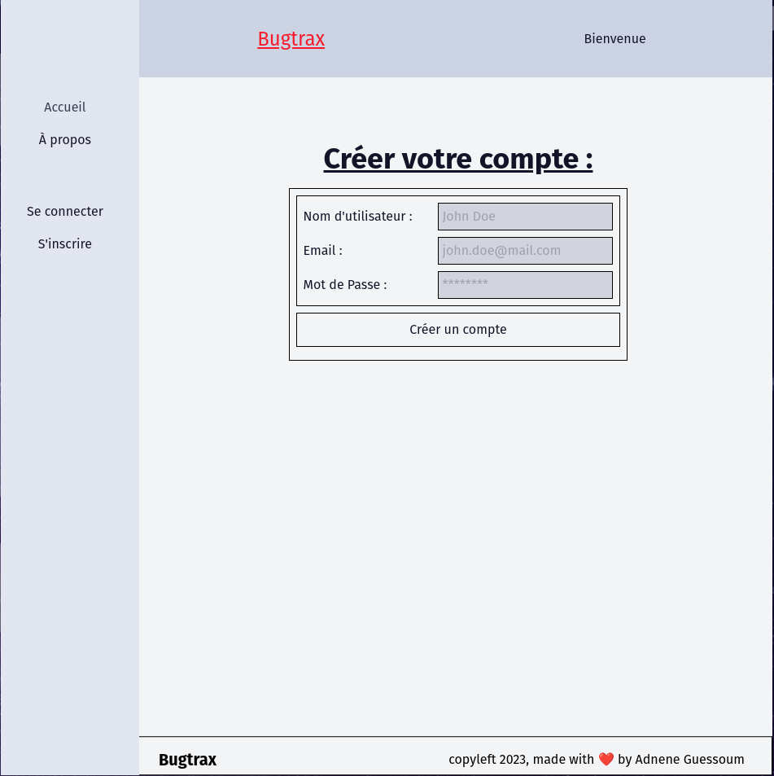
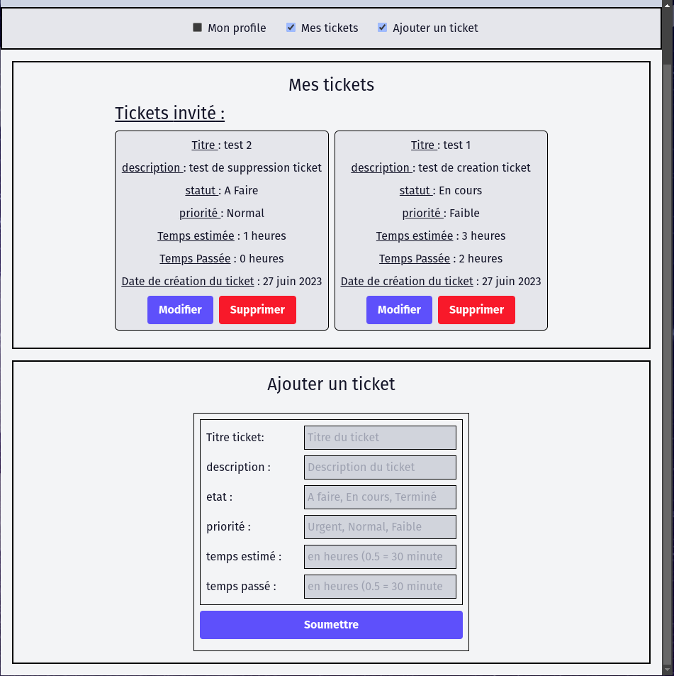
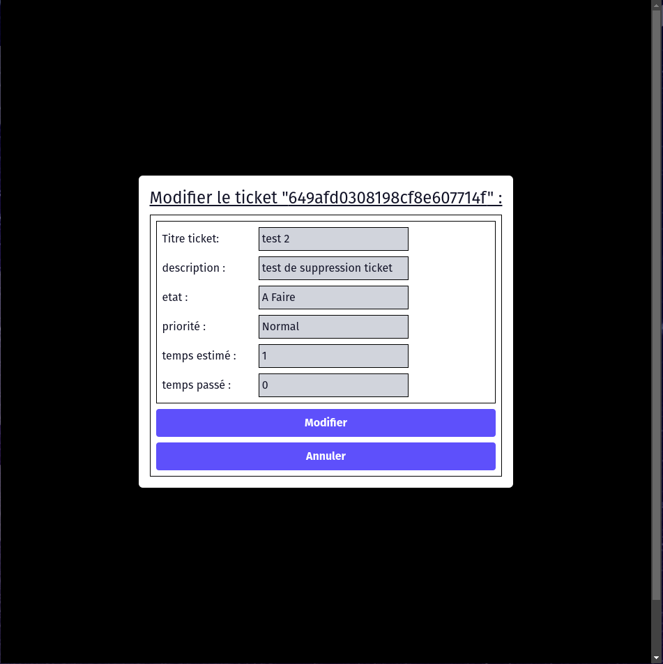
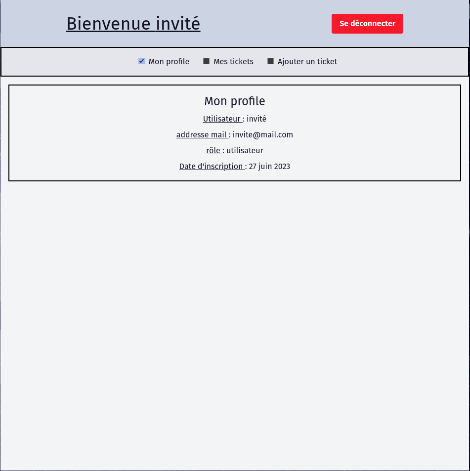

# Web app full stack Bugtracker

## Idée générale du projet:

Bug tracker avec auth, base de données, Dockerization etc...








## Parcours utilisateurs:

En tant qu'utilisateur je veux pouvoir:

- créer un compte
- me connecter
- voir mes tickets
- créer un ticket
- modifier mes tickets
- supprimer mes tickets
- voir mon profile utilisateur

## organisation du projet :

- Frontend next pour UI/UX
- Backend node gestion des utilisateurs / tickets

## Participation / test local du projet:

- fork / clone
- dans le terminal (racine projet):

		```bash
			# pour lancer les conteneurs
			(sudo) docker-compose up --build -d

			# pour arrêter les conteneurs
			(sudo) docker compose down

			# pour entrer dans un conteneur (si besoin)
			(sudo) docker exec -it <nom du conteneur> sh
		```
frontend next: port 3000; backend node: port 8000

- Au démarrage, ou aprés avoir lancer les tests (```npm run test-all```), la base de données est vide.

	Pour créer un compte : cliquer sur s'inscrire et remplir le formulaire.

	Pour utiliser le compte invité : remplir le formulaire avec: nom "invité", email "invite@mail.com", mot de passe "invite"

	vous pourrez ensuite vous connecter et creer, modifier, supprimer vos tickets

- base de données utilisable pour le dev dans conteneurs (montée dans le dossier ./db pour persistance et accèssibillité):

		mongodb: localhost:27017
		admin usernames et passwords pour les tests locaux uniquement
		cf. docker-compose.yml - image mongo officielle

- Tests/lint/format:
	- ```npm run test-all``` dans frontend ou backend: eslint, prettier, type-check et tests unitaires (pour les commandes spécifiques: voir package.json)
	- TODO: pre-commit hooks et Taskfile général (root folder)

- TODO: scripts de population / génération de données pour les db dev

Normalement, tout est bon. si questions, n'hésitez pas.

### (En cours) déploiement:

- docker
- github actions
- CI/CD
- google cloud
- vercel
- mongo atlas

### frontend:

- react/next
- typescript
- tailwind css

### backend:

- node
- express
- mongoose
- mongodb
- typescript

### Progression :

#### démarrer le projet:

- [x] créer le repo
- [x] créer le readme avec explications du projet
- [x] créer le docker-compose / containers pour chaque partie de l'app
- [x] mettre en place intégration continue (gh actions: lint/format/test on push/pull; peut-être pre-hooks commits ? pas décider encore...)
- [x] connecter les bases de données (mongodb): local pour dev
- [x] déploiement continue
- [x] connecter les bases de données de prod projet google cloud ( mongo atlas )

#### En Cours:

Frontend:
- [x] Page Accueil
- [x] pages auth: login page, Register page, formulaires, axios...
- [x] tests unitaires: pages accueil, login, register...
- [x] composants gestion des tickets: ajouter, modifier, supprimer
- [x] gestion des redirects et expiration tokens
- ... cf. Readme front

Backend:
- [x] tests unitaires
- [x] auth et user models
- [x] ticket models
- [x] routes et controllers
- [] e2e tests (TODO)
- ... cf. Readme back
